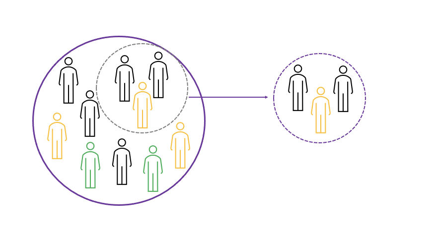
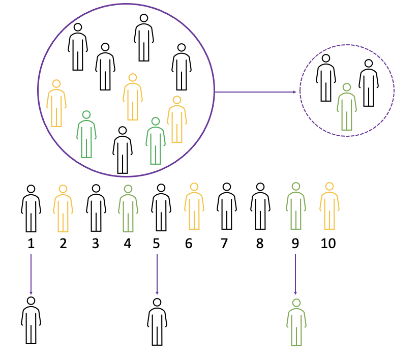
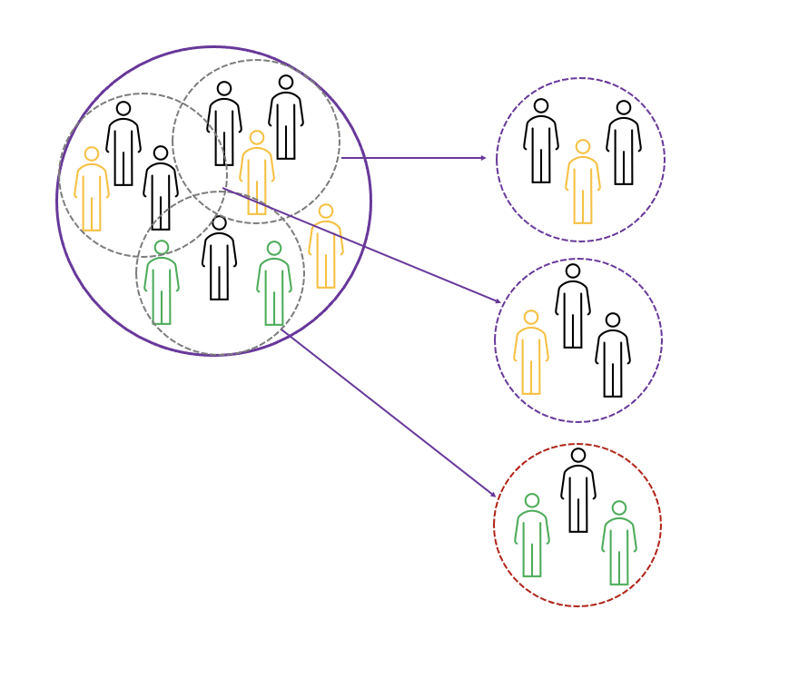
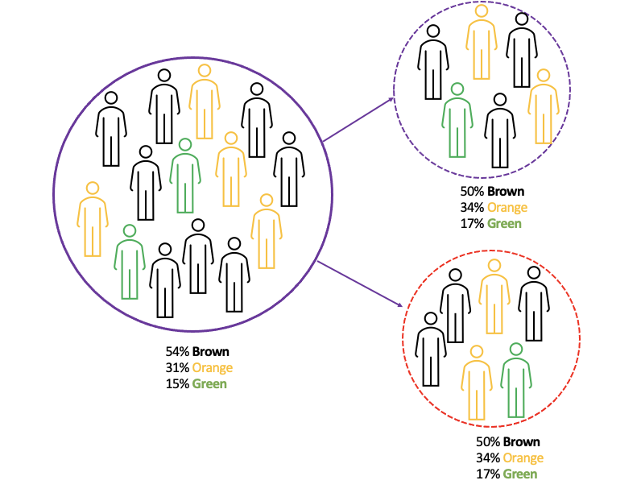
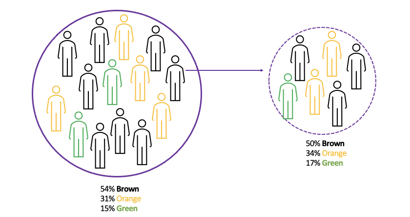

# Statistical Sampling

## What is Statistical Sampling ?
### Statistical sampling is a fundamental technique used in data analysis to draw meaningful conclusions about a larger population based on a smaller subset of data.


## Random Sampling

```
import numpy as np
import pandas as pd
import random

N = 10000
mu = 10
std = 2
population_df = np.random.normal(mu,std,N)


def random_sampling(df, replace, n):
    random_sample = np.random.choice(df,replace = False, size = n)
    return(random_sample)
```

## Systematic Sampling

### The population population is ordered or arranged in a list, and samples are selected at fix intervals from the list. The sampling interval is determined by dividing the population size by the desired sample size.
```
def systematic_sampling(df, step):

    id = pd.Series(np.arange(1,len(df),1))
    df = pd.Series(df)
    df_pd = pd.concat([id, df], axis = 1)
    df_pd.columns = ["id", "data"]
    # this indices will increase with the step amount not 1
    selected_index = np.arange(1,len(df),step)
    # using iloc for getting thee data with selected indices
    systematic_sampling = df_pd.iloc[selected_index]
    return(systematic_sampling)

n = 10
step = int(N/n)
print(systematic_sampling(population_df, step))
```

## Data Generation for the following sampling techniques:
```
price_vb  = pd.Series(np.random.uniform(1,4,size = N))
id = pd.Series(np.arange(0,len(price_vb),1))
event_type = pd.Series(np.random.choice(["type1","type2","type3"],size = len(price_vb)))
df = pd.concat([id,price_vb,event_type],axis = 1)
df.columns = ["id","price","event_type"]
```

## Cluster Sampling

### Dividing the population into groups or clusters based on certain characteristics or geographical proximity. Instead of selecting individual elements, entire clusters are randomly selected and included in the sample.
```
def get_clustered_Sample(df, n_per_cluster, num_select_clusters):
    N = len(df)
    K = int(N/n_per_cluster)
    data = None
    for k in range(K):
        sample_k = df.sample(n_per_cluster)
        sample_k["cluster"] = np.repeat(k,len(sample_k))
        df = df.drop(index = sample_k.index)
        data = pd.concat([data,sample_k],axis = 0)

    random_chosen_clusters = np.random.randint(0,K,size = num_select_clusters)
    samples = data[data.cluster.isin(random_chosen_clusters)]
    return(samples)

print(get_clustered_Sample(df = df, n_per_cluster = 100, num_select_clusters = 2))
```

## Stratified Sampling

### The population is divided into mutually exclusive and collectively exhaustive subgroups, or strata, based on certain characteristics or variables of interest. Each stratum represents a subset of the population that shares similar attributes.
```
def get_startified_sample(df,n,num_clusters_needed):
    N = len(df)
    num_obs_per_cluster = int(N/n)
    K = int(N/num_obs_per_cluster)

    def get_weighted_sample(df,num_obs_per_cluster):
        def get_sample_per_class(x):
            n_x = int(np.rint(num_obs_per_cluster*len(x[x.click !=0])/len(df[df.click !=0])))
            sample_x = x.sample(n_x)
            return(sample_x)
        weighted_sample = df.groupby("event_type").apply(get_sample_per_class)
        return(weighted_sample)

    stratas = None
    for k in range(K):
        weighted_sample_k = get_weighted_sample(df,num_obs_per_cluster).reset_index(drop = True)
        weighted_sample_k["cluster"] = np.repeat(k,len(weighted_sample_k))
        stratas = pd.concat([stratas, weighted_sample_k],axis = 0)
        df.drop(index = weighted_sample_k.index)
    selected_strata_clusters = np.random.randint(0,K,size = num_clusters_needed)
    stratified_samples = stratas[stratas.cluster.isin(selected_strata_clusters)]
    return(stratified_samples)

print(get_startified_sample(df = df,n = 100,num_clusters_needed = 2))
```

## Weighted Sampling

### Also known as Probability Proportional to Size (PPS) sampling, is a sampling technique used in statistical where elements in a population are selected with different probabilites based on their relative importance or size.
```
def get_weighted_sample(df,n):

    def get_class_prob(x):
        weight_x = int(np.rint(n * len(x[x.click != 0]) / len(df[df.click != 0])))
        sampled_x = x.sample(weight_x).reset_index(drop=True)
        return (sampled_x)
        # we are grouping by the target class we use for the proportions

    weighted_sample = df.groupby('event_type').apply(get_class_prob)
    print(weighted_sample["event_type"].value_counts())
    return (weighted_sample)

print(get_weighted_sample(df,100))
```